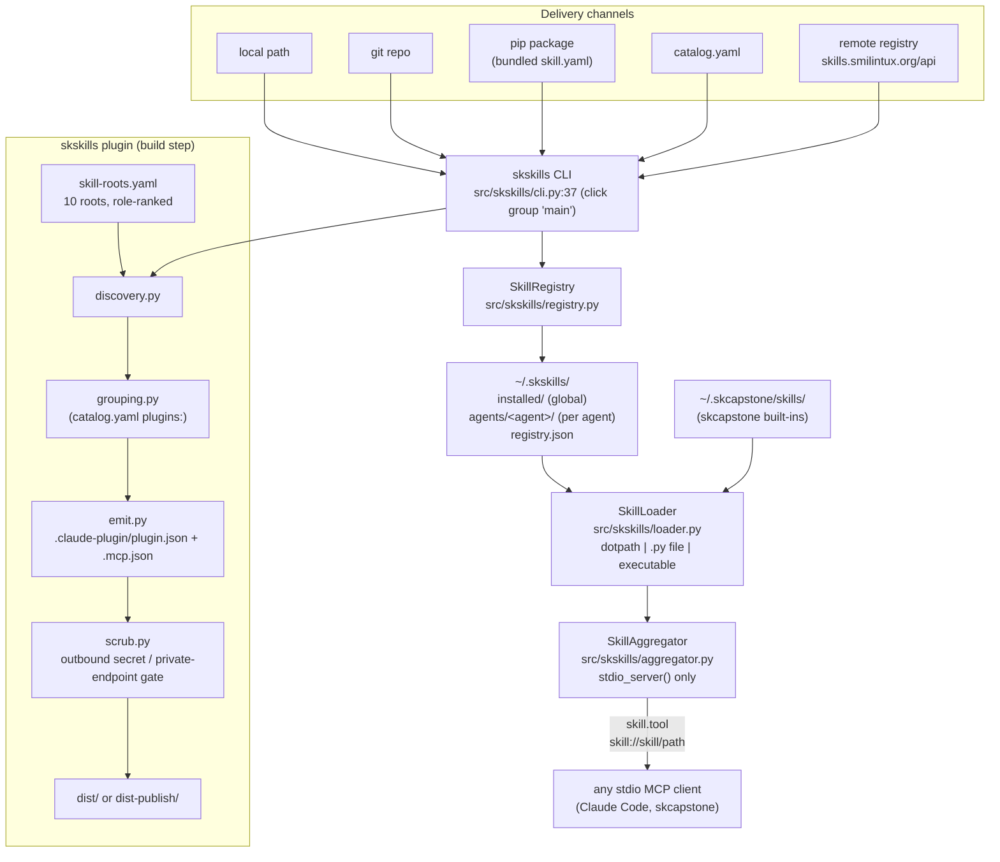

# SKSkills - Standard Operating Procedures

**Kind:** library (Python package + CLI + stdio MCP aggregator, also published as an npm shell package).
**Maturity-tier:** T0 (classical). See [§9](#9-maturity-tier--version-reference).
**Canonical-home:** this file.

skskills is the capability-delivery layer of SKWorld. It defines the `skill.yaml`
manifest, installs skills into a local registry under `~/.skskills/`, resolves each
tool entrypoint to a callable, and proxies every enabled skill through **one stdio
MCP server**. It is called by `skcapstone`, by Claude Code (through the emitted
plugin envelope), and by any agent that speaks stdio MCP.

> Deeper design lives in [`docs/ARCHITECTURE.md`](docs/ARCHITECTURE.md); the
> consumer map lives in [`docs/DEPENDENTS.md`](docs/DEPENDENTS.md). This SOP is the
> operational source of truth and supersedes both where they disagree.

---

## 1. Overview

**Purpose.** Give every agent capability the same shape (a `skill.yaml` manifest),
the same lifecycle (install, enable, load, run), and the same delivery channels
(local path, git repo, pip package, remote registry, curated catalog), then serve
all of them to an MCP client over a single stdio socket.

### What it owns

| Surface | Where |
|---|---|
| The `skill.yaml` manifest schema (Pydantic) | `src/skskills/models.py` |
| The local registry: install / uninstall / enable / disable / link | `src/skskills/registry.py` |
| Entrypoint resolution (dotpath, `.py` file, executable script) | `src/skskills/loader.py` |
| The stdio MCP aggregator and its health / collision reporting | `src/skskills/aggregator.py` |
| The curated first-party catalog and its `plugins:` grouping defs | `catalog.yaml` |
| The remote registry client (publish, pull, package, checksum) | `src/skskills/remote.py` |
| The pip bridge (a `skill.yaml` shipped inside a pip package) | `src/skskills/pip_bridge.py` |
| The plugin compiler: discover, group, emit, scrub, publish | `src/skskills/plugin/` |
| The multi-root skill discovery map | `src/skskills/plugin/skill-roots.yaml` |

### What it explicitly does NOT do

- **It does not listen on a port.** The aggregator is stdio-only. See
  [§5 Front-end / Exposure](#front-end--exposure).
- **It does not run as a service.** No systemd unit ships in this repo and none was
  found on the fleet control node (.158) or the builder node (.41) as of 2026-08-14.
- **It does not verify skill signatures.** The manifest carries `signature` and
  `signed_by` fields and `skskills list` prints a "signed" column, but no code in
  `src/` verifies a PGP signature. See [SECURITY.md](SECURITY.md) for the full
  statement of this gap.
- **It does not own the skills.** Skills live in ten different homes on disk
  (see [§6](#skill-discovery-roots-the-real-topology)); this repo carries only four
  of them under `skills/`.
- **It is not the identity root of trust.** Keys and fingerprints come from
  [capauth](https://github.com/smilinTux/capauth).

---

## 2. Architecture



### Start here

| File | Why you open it first |
|---|---|
| `src/skskills/cli.py` | The Click group `main` (line 37) and every lifecycle command. Line 47 mounts the `plugin` compiler group. |
| `src/skskills/aggregator.py` | `SkillAggregator`, the MCP tool surface, and `main()` (line 659). `stdio_server()` at line 651 is the whole transport story. |
| `src/skskills/loader.py` | How an `entrypoint:` string becomes a callable, and where `SKSKILLS_HOME` is honoured (lines 282-284). |
| `src/skskills/registry.py` | The on-disk layout: `installed/`, `agents/<agent>/`, `registry.json`. |
| `src/skskills/plugin/skill-roots.yaml` | The ten skill homes the compiler scans, and which one is canonical. Read this before believing any claim about "where skills live". |

---

## 3. Build

There are two distinct meanings of "build" here. Do not confuse them.

### 3.1 Build the Python package

```bash
cd /path/to/skskills
python -m pip install -e ".[dev]"          # editable install into the ~/.skenv venv
python -m build                            # sdist + wheel into dist/
```

Both console scripts come from `pyproject.toml [project.scripts]`:

```
skskills            = skskills.cli:main
skskills-aggregator = skskills.aggregator:main
```

### 3.2 Build the Claude plugin envelope (the compiler)

`skskills plugin` compiles discovered skills into the Anthropic plugin/marketplace
envelope. It reads live host state (see the warning below), so it is a developer
workstation step, not a CI step.

```bash
skskills plugin discover                              # list every skill found, with role + runtime
skskills plugin build --plugin skcomms --out dist     # emit dist/skcomms/.claude-plugin/plugin.json + .mcp.json
skskills plugin validate --out dist                   # valid JSON + kebab-case name for every manifest
skskills plugin publish --plugin skcomms --i-am-chef  # three-gate scrub, then publish-target artifacts
```

The `publish` path enforces three gates in `src/skskills/plugin/scrub.py:gate_publish`:
the plugin must be marked `publish: true` in `catalog.yaml`, the operator must pass
`--i-am-chef` explicitly, and the emitted directory must scan clean for secrets
(`ghp_`, `github_pat_`, `xox[baprs]-`, `AKIA`, PEM private-key headers) and private
endpoints (RFC1918, CGNAT/tailnet `100.64.0.0/10`, `*.ts.net`). Any finding blocks the
publish and nothing is written to the target.

> **Warning: `plugin discover` and `plugin build` are not hermetic.** With no
> `--roots` override they load the bundled `skill-roots.yaml` and walk the real
> filesystem of the machine they run on, so their output depends on host state.
> An unreadable `SKILL.md` no longer aborts the walk: it is skipped and logged at
> WARNING (`discovery._read_skill_md`), so the skill silently missing from the
> output is the failure mode to look for (see [§8](#8-troubleshooting)). Neither
> `plugin build` nor `plugin validate` runs in CI.

---

## 4. Test

```bash
python -m pytest tests/ -q
```

| Fact | Value (verified 2026-08-15, worktree `fix/discovery-walk-resilience`, Python 3.12) |
|---|---|
| Result | **137 passed, 0 failed** |
| Previously | 133 passed, 1 failed. `tests/plugin/test_pilot_skcomms.py::test_skcomms_builds_and_validates` invoked `skskills plugin build` with no `--roots` override, so discovery walked the developer's real skill homes and hit a dangling `SKILL.md` symlink. Fixed two ways under card 748c82f9: the walk now skips an unreadable `SKILL.md` instead of aborting, and the test passes its own `--roots` pinned to this repo's `skills/` dir so it no longer depends on host state. |

### The release gate

`.github/workflows/ci.yml` runs the suite with no `|| true`, so a red suite fails the
run. `.github/workflows/publish.yml` repeats the same job and gates `publish-pypi` and
`publish-npm` on plain `needs: test` with no `if: always()`, so failing tests block
both publishes.

- This was **not** always true. Until card **62a5256d** both files used
  `python -m pytest tests/ -v --tb=short || true`, and both publish jobs carried
  `needs: test` **plus** `if: always()`, meaning a total test wipe-out still shipped to
  PyPI and npm. If you see either pattern come back in a diff, it is a regression.
- Jobs that can fail a run today: `test` and `lint` (`ruff check src/`, ruff pinned to
  0.15.4) in `ci.yml`, `docs-check.yml`, and `secret-scan.yml` (gitleaks 8.28.0, full
  history, `--exit-code 1`).
- `ruff check` covers `src/` only. `tests/` is not linted and does not currently pass
  `ruff check`.

### Self-report

There is **no** `skskills status`, **no** `skskills doctor`, and **no** HTTP health
endpoint. The only self-report is the MCP tool `skskills.health`, registered at
`aggregator.py:173` and handled at `aggregator.py:380`. It returns per-skill
`ok` / `degraded` / `error`, the tool names that failed to resolve, and load errors.
`skskills.collisions` reports base tool-name overlaps across skills.

---

## 5. Release / Deploy

skskills is a library. There is nothing to deploy and nothing to roll back on a host;
"release" means publishing two artifacts.

### 5.1 Artifacts

| Artifact | Registry | Built by |
|---|---|---|
| `skskills` (sdist + wheel) | PyPI | `publish.yml` job `publish-pypi` (`python -m build`, `twine upload`) |
| `@smilintux/skskills` | npm | `publish.yml` job `publish-npm` (`npm publish --access public`) |

Both jobs trigger on a pushed tag matching `v*`.

### 5.2 Version bump (read this before tagging)

**There is no single authoritative version in this repo.** Five files declare one and
they disagree:

| File | Declares |
|---|---|
| `pyproject.toml` | 0.2.0 |
| `src/skskills/__init__.py` (`__version__`, line 8) | 0.2.0 |
| `package.json` | 0.1.0 |
| `skill.yaml` | 0.1.0 |
| `SKILL.md` (header) | 0.1.0 |

The npm package therefore ships two minors behind the Python one, and a tag push
publishes both from the same commit without reconciling them. Until this is fixed
(the durable fix is deriving the version from the git tag rather than hardcoding it
in five places), a release means:

1. Decide the version once.
2. Update **all five** files in the same commit.
3. Add a dated `CHANGELOG.md` entry.
4. Confirm `python -m pytest tests/ -q` is green locally. CI also enforces this now,
   and the `test` job blocks both publish jobs.
5. Tag `vX.Y.Z` and push **the tag only after** the branch is merged.

> **Never push a tag speculatively.** A `v*` tag publishes to PyPI and npm
> immediately, and neither registry allows re-uploading the same version.

### 5.3 Rollback

There is no in-place rollback of a published package. Recovery is: yank or deprecate
the bad version on the registry, publish a fixed patch version, and pin dependents
(`skcapstone` declares `skskills>=0.1.1`) to the good one.

### Front-end / Exposure

**N/A - no network surface.**

skskills binds no address, opens no listening socket, and serves no HTTP route. The
aggregator is stdio-only: `from mcp.server.stdio import stdio_server`
(`aggregator.py:37`), entered at `aggregator.py:651`. There is no public `:443`
route and no tier assignment, because there is nothing to expose.

Two things in this repo look like endpoints and are not:

| Looks like | What it actually is |
|---|---|
| `src/skskills/plugin/mcp-registry.yaml` lists `http://127.0.0.1:9384/...` (skcomms) and `http://<host>.ts.net:9386/sse` (sk-access) | Connection specs for **other** services, copied into emitted `.mcp.json` files. skskills never binds them. |
| `remote.py:36` `DEFAULT_REGISTRY_URL = "https://skills.smilintux.org/api"` | An **outbound** target for `pull` / `publish` / `remote-search`. skskills is the client, never the server. |

---

## 6. Configuration / Usage

### 6.1 Environment

| Variable | Default | Read at | Effect |
|---|---|---|---|
| `SKSKILLS_HOME` | `~/.skskills` | `loader.py:282`, `registry.py:34` | Relocates the whole registry root. |
| `SKCAPSTONE_HOME` | `~/.skcapstone` | `aggregator.py:101` | Where the aggregator looks for skcapstone built-in skills. |
| `SKSKILLS_TOKEN` | unset | `cli.py:399` (`--token` envvar) | CapAuth bearer token for `skskills publish`. |

`SKILLS_HOME = "~/.skskills"` is the module-level default in
`src/skskills/__init__.py:10`.

### 6.2 Registry layout

```
~/.skskills/
  installed/            global namespace
    <skill>/skill.yaml
  agents/
    <agent>/            per-agent namespace (may be a symlink into installed/)
      <skill>/skill.yaml
  registry.json         status + metadata index
```

**Aggregator resolution order** (first hit wins, agent overrides global):
`~/.skskills/agents/<agent>/` then `~/.skskills/installed/` then
`~/.skcapstone/skills/`. Fully-qualified `skill.tool` names stay unique, so proxying
is unambiguous; base-name overlaps are reported by the `skskills.collisions` tool
rather than silently resolved.

### 6.3 Skill discovery roots (the real topology)

The compiler does **not** assume a single source of truth, and neither should you.
`src/skskills/plugin/skill-roots.yaml` declares **ten** roots. `role` breaks name
collisions, ranked in `discovery.py:_ROLE_PRECEDENCE` (lower wins):

| # | Path | Runtime | Role | Precedence |
|---|---|---|---|---|
| 1 | `~/clawd/skskills/skills` | skskills | **canonical** | 0 |
| 2 | `~/.skskills/installed` | skskills | registry | 1 |
| 3 | `~/.skskills/agents/*` | skskills | registry | 1 |
| 4 | `~/clawd/skcapstone-repos/*/skills` | repo | repo | 2 |
| 5 | `~/.hermes/skills` | hermes | runtime | 3 |
| 6 | `~/.hermes/profiles/*/skills` | hermes | runtime | 3 |
| 7 | `~/clawd/skills` | claude-code | **incubator** | 4 |
| 8 | `~/.claude/skills` | claude-code | personal | 5 |
| 9 | `~/.config/opencode/skills` | opencode | future-hook | 6 |
| 10 | `~/.codex/skills` | codex | future-hook | 6 |

`import_hermes_skills_hub: true` additionally pulls any paths listed under
`skills_hub` in `~/.hermes/config.yaml` and appends them as `runtime` roots, so the
effective root count on a given host can exceed ten.

**Canonical is where a skill SHOULD live. Incubator is where most of them ARE.**
Verified 2026-08-14: this repo's `skills/` on `origin/main` contains **four** skills
(`bot-roundtrip-canary`, `chat`, `unhinged-mode`, `who`), while the incubator root
`~/clawd/skills` holds **83** skill directories on the primary workstation. The
project convention "author skills in `~/clawd/skskills/skills/<name>/` only" is a
migration target, not the current state. Anything that assumes one root will miss
most of the fleet's skills.

Related: the `superpowers` skill set is **not** in skskills at all. It is a Claude
Code plugin installed at
`~/.claude/plugins/cache/claude-plugins-official/superpowers`, outside every root
above.

### 6.4 Everyday usage

```bash
skskills init my-skill --author "you"       # scaffold knowledge/ tools/ hooks/ + skill.yaml
skskills install ./my-skill                 # install into the global namespace
skskills install ./my-skill --agent lumina  # install into an agent namespace
skskills list                               # version, agent, types, tools, signed
skskills info my-skill                      # full manifest detail
skskills run --agent lumina                 # start the aggregator MCP server on stdio
```

---

## 7. API / Reference

### 7.1 CLI

`skskills` (`cli.py:37`). Commands, with their source line:

| Command | Line | Purpose |
|---|---|---|
| `init` | 55 | Scaffold a new skill project. |
| `install` | 103 | Install from a local path or URL. |
| `list` | 122 | List installed skills. |
| `info` | 166 | Manifest detail for one skill. |
| `uninstall` | 208 | Remove an installed skill. |
| `link` | 225 | Symlink a global skill into an agent namespace. |
| `search` | 239 | Match installed skills by name / description / tag. |
| `enable` / `disable` | 270 / 283 | Toggle whether a skill's tools are exposed. |
| `update` | 297 | Reinstall from a source. |
| `run` | 315 | Start the aggregator on stdio. |
| `remote-search` | 337 | Query the remote registry. |
| `pull` | 379 | Download and install from the remote registry. |
| `publish` | 400 | Publish a skill to the remote registry (CapAuth bearer token). |
| `package` | 421 | Build a tarball plus SHA-256 sidecar. |
| `clone` | 439 | Install straight from a git repo. |
| `pip-install` | 469 | Register a skill bundled inside a pip package. |
| `catalog list/info/search/install` | 526 / 565 / 594 / 626 | Browse and install from `catalog.yaml`. |

`skskills plugin` (Click group at `plugin/cli.py:32`): `discover` (`discover_cmd`,
line 39), `build` (52), `validate` (72), `publish` (103), `add` (124).

### 7.2 MCP tools exposed by the aggregator

Beyond every installed skill's own `skill.tool` entries and `skill://` resources, the
aggregator registers its own control tools in `aggregator.py:_setup_handlers`:

| Tool | Line | Purpose |
|---|---|---|
| `skskills.list` | 118 | List all installed skills and their status, optionally filtered by agent. |
| `skskills.skills` | 132 | List loaded (active) skills with their tool namespaces. |
| `skskills.info` | 141 | Manifest detail, including `signed` / `signed_by` as **claimed**, not verified. |
| `skskills.run_tool` | 155 | Invoke a qualified `skill.tool` by name. |
| `skskills.health` | 173 | Per-skill `ok` / `degraded` / `error`, unresolved tools, load errors. |
| `skskills.collisions` | 191 | Base tool-name overlaps across skills. |

### 7.3 Manifest schema

`src/skskills/models.py`. `SkillManifest` carries `name` (kebab-case enforced by a
validator), `version`, `description`, `author` (`SkillAuthor`, with an optional
CapAuth `fingerprint`), `knowledge[]`, `tools[]`, `hooks[]`, `dependencies[]`,
`python_requires`, `tags[]`, and the `signature` / `signed_by` pair. `is_signed()`
(line 178) returns true when both signature strings are merely non-empty; it performs
no cryptographic check.

### 7.4 Known manifest drift (do not trust the root `skill.yaml`)

The repo-root `skill.yaml` declares four tool entrypoints:

```
skskills.skill:list_tools
skskills.skill:install
skskills.skill:catalog
skskills.skill:run_tool
```

**`src/skskills/skill.py` does not exist on `origin/main`.** Verified 2026-08-14
against the tree. Any consumer that resolves those dotpaths will fail. The working
tool surface is the aggregator's, documented in §7.2. Treat the root `skill.yaml`
tool list as stale until either the module is written or the manifest is corrected.

---

## 8. Troubleshooting

| Symptom | Check |
|---|---|
| A skill you expect is missing from `skskills plugin discover` | Its `SKILL.md` is probably unreadable (dangling symlink, permissions). Since card 748c82f9 the walk skips it and logs `skipping unreadable SKILL.md <path>: <reason>` at WARNING instead of aborting, so run with logging on to see it. Find broken links directly: `for f in ~/clawd/skills/*/SKILL.md ~/clawd/skskills/skills/*/SKILL.md; do [ -e "$f" ] || echo "broken: $f"; done`. Repoint or remove the link. |
| `plugin build --plugin X` says `no plugin named 'X'` | `X` is not in the top-level `plugins:` list of `catalog.yaml` (line 425 onward), or discovery found no skill matching its `include_tags` / `include_names`. Run `skskills plugin discover` first. |
| A skill installs but its tools never appear in the MCP client | It is disabled, or in the wrong namespace. Check `skskills list --agent <agent>`, then call the `skskills.health` MCP tool: a `degraded` status lists exactly which entrypoints failed to resolve. |
| Two skills expose the same tool name | Expected and non-fatal. Qualified `skill.tool` names stay unique. Call `skskills.collisions` to see the overlap set. |
| `skskills list` shows a skill as signed but you cannot tell by whom | The `signed` column reflects only that `signature` and `signed_by` are non-empty strings. **Nothing verifies them.** See [SECURITY.md](SECURITY.md). |
| Registry writes land somewhere unexpected | `SKSKILLS_HOME` is set. `echo $SKSKILLS_HOME`; unset it to fall back to `~/.skskills`. |
| CI is green but the code is broken | Check the `test` job actually ran the suite. If a diff reintroduced `|| true` on the pytest step, CI green means nothing. Card 62a5256d removed it. |
| A tag published a broken release | The `test` job in `publish.yml` gates both publish jobs, so this should now be blocked. If it shipped anyway, check whether `if: always()` came back on `publish-pypi` / `publish-npm`. Yank on the registry and ship a patch; see §5.3. |
| `skskills publish` refuses with `BLOCKED:` lines | The scrub gate found a secret or a private endpoint in the emitted artifacts, or `publish: true` / `--i-am-chef` is missing. Read each reason; **do not** weaken `scrub.py` to get past a real finding. |

---

## 9. Maturity-tier + Version reference

**Maturity-tier: T0 (Classical)**, per
[CRYPTOGRAPHY_STANDARD](https://github.com/smilinTux/sk-standards/blob/main/standards/CRYPTOGRAPHY_STANDARD.md)
maturity tiers. skskills performs no key exchange and no signing. It uses SHA-256 for
tarball integrity only (`remote.py:229`), which is a Grover-only symmetric surface and
is not weakened by a quantum adversary in any way that matters here. skskills is
**not** a crypto component: it neither generates, exchanges, signs, verifies, wraps,
nor stores key material. It does *display* a signature claim it never checks, which is
a supply-chain gap recorded in [SECURITY.md](SECURITY.md), not a crypto claim.

**Version:** hardcoded in five places that currently disagree. See
[§5.2](#52-version-bump-read-this-before-tagging) for the table and the bump
procedure. Do not quote "the skskills version" without saying which file you read.

**License:** GPL-3.0-or-later. `LICENSE` is the verbatim GPLv3 text;
`pyproject.toml` and `package.json` both declare `GPL-3.0-or-later`. This predates
the 2026-08-14 fleet default and is unchanged by it.

**Standards backlink:**
[sk-standards](https://github.com/smilinTux/sk-standards) is the canonical home for
SK_REPO_DOC_STANDARD, SECURITY_DISCLOSURE_STANDARD, and TESTING_AND_CI_STANDARD.

---

## Unverified / needs an operator pass

Facts this SOP could **not** confirm from the repo or from the two node inventories
available on 2026-08-14:

1. **Who actually runs the aggregator, and how.** No systemd unit, no wrapper script,
   and no MCP client config in this repo names `skskills-aggregator`. The launch path
   used in practice (a Claude Code `.mcp.json`, a `skcapstone` spawn, or a manual
   `skskills run`) is undocumented here.
2. **Whether `skills.smilintux.org/api` is live**, what it authenticates, and whether
   any skill has ever been published or pulled through it. The client exists; the
   server side is out of scope for this repo and unverified.
3. **The security contact PGP fingerprint.** SECURITY.md names GitHub private
   vulnerability reporting as the primary channel and points at the SKWorld capauth
   identity for out-of-band reports, but no fingerprint is published here because none
   could be verified as this repo's.
4. **Whether PyPI / npm publishing currently works at all.** `publish.yml` requires
   `PYPI_API_TOKEN` and `NPM_TOKEN` repository secrets; their presence and validity
   were not checked.
5. **The state of the other nine discovery roots on nodes other than the primary
   workstation.** The 4-vs-83 canonical/incubator count is verified for this host only.

<!-- docs-evidence
verified: 2026-08-15
checks:
  - name: console entry points match pyproject
    run: grep -qF 'skskills = "skskills.cli:main"' pyproject.toml && grep -qF 'skskills-aggregator = "skskills.aggregator:main"' pyproject.toml
  - name: SKILLS_HOME default is still ~/.skskills
    run: grep -qF 'SKILLS_HOME = "~/.skskills"' src/skskills/__init__.py
  - name: aggregator is stdio only, no HTTP listener anywhere in src
    run: grep -qF 'from mcp.server.stdio import stdio_server' src/skskills/aggregator.py && ! grep -rqE 'uvicorn|FastAPI|aiohttp|\.bind\(|hypercorn' src/skskills/
  - name: remote registry URL is the documented outbound target
    run: grep -qF 'DEFAULT_REGISTRY_URL = "https://skills.smilintux.org/api"' src/skskills/remote.py
  - name: skill-roots still declares 10 roots with canonical and incubator roles
    run: test "$(grep -cE '^  - \{ path:' src/skskills/plugin/skill-roots.yaml)" = 10 && grep -qE 'role: canonical' src/skskills/plugin/skill-roots.yaml && grep -qE 'role: incubator' src/skskills/plugin/skill-roots.yaml
  - name: publish scrub gate still requires an explicit flag and scans for secrets
    run: grep -qF '"--i-am-chef"' src/skskills/plugin/cli.py && grep -qF 'ghp_' src/skskills/plugin/scrub.py
  - name: documented defect still present, root skill.yaml points at a missing module
    run: test ! -e src/skskills/skill.py && grep -qF 'skskills.skill:list_tools' skill.yaml
  - name: CI test step can fail the run, no `|| true` anywhere in ci.yml
    run: grep -qF 'run: python -m pytest tests/ -v --tb=short' .github/workflows/ci.yml && ! grep -q '|| true' .github/workflows/ci.yml
  - name: publish jobs are gated on tests, no `|| true` and no `if: always()`
    run: ! grep -q '|| true' .github/workflows/publish.yml && ! grep -q 'if: always()' .github/workflows/publish.yml && test "$(grep -c 'needs: test' .github/workflows/publish.yml)" = 2
  - name: the discovery walk guards its SKILL.md read
    run: grep -qF 'def _read_skill_md' src/skskills/plugin/discovery.py && grep -qF 'skipping unreadable SKILL.md' src/skskills/plugin/discovery.py
  - name: the skcomms pilot test is hermetic, it pins its own roots
    run: grep -qF '"--roots", _hermetic_roots(tmp_path)' tests/plugin/test_pilot_skcomms.py
-->
